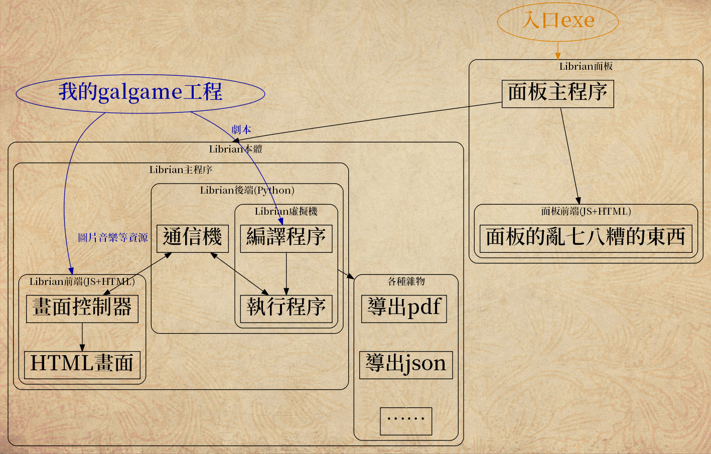

# 軟件結構

這一章是給真正的程序員看的。  
也許可以提高你的編程能力，但是對開發Galgame沒有什麼幫助。

所以說不看也沒什麼關係，如果你也想開發Galgame引擎的話可以參考一下。不過等到時代改變以後，這些技術說不定也用不上了。

不過裏面也有一些隨性寫的部分，反正很快就過時了所以沒關係。

## 大體

{:.極}  

按數據在各個功能間的流動畫了這樣一幅圖，大概就是這樣的意思了。

### Librian面板的部分

這個項目裏所有的exe都是假的，裏面的代碼都是靜態的。  
無論是你生成的exe，還是Librian面板的exe，其內容都只有調用python執行py文件。

安裝完Librian以後，點擊「Librian面板.exe」。這個入口exe會讓python啓動Librian面板，它其實是一個獨立的帶前後端的程序，和Librian本體也沒什麼關係。

在Librian面板裏選擇工程，啓動，它會系統調用python來啓動Librian主程序——將要運行的工程當作參數傳過去。

### Librian主程序的部分

Librian主程序首先運行Librian虛擬機，這是一個運行劇本的容器。

它讀取劇本，將其編譯成一個JSON，之後用一個指針在其中逐句執行，更新自身的狀態，畫面狀態也是它的一部分。

當Librian虛擬機走到停滯點時，就會把當前的畫面狀態導出，由通信機傳給前端。在前端用鼠標單擊，會向後端發送一個步進命令，讓Librian虛擬機繼續走。

這樣就循環起來了。

