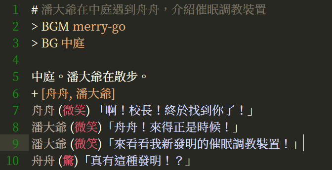

# 劇本寫法
Librian的劇本寫法接近真實的劇本，力求易讀易寫。

## 文本格式

其實可以參考樣例劇本大概就明白了。
就是直接寫的一段話就是旁白。
前面帶名字的就是人物對話。

**簡單的樣例:**

    機房的門上鎖了，潘大爺被關在外面。
    潘大爺 「你們別玩了快來給我開門！」

第一句是旁白，第二句是潘大爺說的話。   
人物對話的特徵是，用方引號圈住言語，人名後有一個空格。   
在後方引號之後的空格会被忽略。

**名字的變體:**

    傑克|黑衣人 (笑)「咕嘿嘿。」

結果: 人物立繪展現爲傑克，但對話框的名字是【黑衣人】，用於劇情上人名無法得知的場合。此時立繪中傑克的表情是 笑，如果你正確地準備了立繪文件的話，就會使用他洋溢着笑容的表情。

**使用特效:**

    潘大爺 [灰](驚)「什麼情況！」

結果: 潘大爺擺出驚訝的表情，人物呈現爲灰色。  
其中 \[灰\] 爲使用的特效，可以和表情一起使用，也可以單獨使用。

**多行對話:**

    潘大爺 「
        歡迎來到莆田理工大學……
        欸，上面已經說過這句了嗎？
        不好意思。
    」

在遊戲中也會表現爲三行對話。   
縮進的空格並不是必須的。   
同樣可以使用人物的表情、特效以及豎線符號。

**隱式的:**

    潘大爺 (嘆)

相比之下少了後面的方引號內的內容。   
這不會作爲潘大爺說的一句話來處理，也不需要玩家點擊來跳過，但是會把鏡頭指向潘大爺並改變潘大爺的表情和特效。

**html格式:**

對話中可以自由地嵌入html來增強表現力，html也會渲染到adv畫面中。

    幼馴染 「<small>不是特意給你做的</small>」

顯示的效果大概是這樣:    

>&nbsp;&nbsp;&nbsp;幼馴染    
>「<small>不是特意給你做的</small>」

<small>(這個地方原本寫的人物是潘大爺……人物崩壞真可怕……)</small>

關於可用的內置特效和自定義特效，參考 [進階/特效](../進階/特效.md)。  
關於立繪的自動化，參考下方的「立繪安排」。關於如何準備立繪，參考 [用戶指南/立繪](立繪.md)。

## 劇本功能

### 用法

一般以 ><small>(大於號)</small> 開頭的是控制的函數。   
它們將會對劇本的演出產生控制作用。

<small>(用豎線分割的漢字是給看到英文就頭大的開發者提供的中文寫法)</small>

包括:

+ **> BG | 背景** 背景圖片文件名   
+ **> BGM | 背景音樂 | 背景音乐** 背景音樂文件名   
+ **> CG** CG的文件名   
+ **> CLASS** 元素 效果   
+ **> VIDEO | 視頻 | 视频** 影片的名字   
+ **> py/endpy** (用於插入一段python代碼)    
+ **> js/endjs** (用於插入一段javascript代碼)    
+ **> WRAP | 快速選項 | 快速选项** 快速控制選項和跳轉   

***BG* 會更換當前的BG爲你指定的文件。**   
BG總是在一點時間內漸變的。   
語法:
```    
    > BG {{文件名}}
```
樣例:
```
    > BG 家裏.png
    > 背景 街.png
```
***BGM* 會更換當前的BGM爲你指定的文件。**   
如果指定爲None，會有一點淡出時間。但總是沒有淡入。   
語法:
```    
    > BGM {{文件名}} {{音量=1}}
```
樣例:
```
    > BGM 愉快的音樂.mp3
    > 背景音樂 不愉快的音樂.ogg 0.5
    > BGM None
```

***CG* 進入CG模式並立即使用指定的CG。**   
在CG模式下，CG佔據整個畫面，立繪不會被顯示，背景也是無效的。   
不指定參數會解除CG模式。   
語法:
```
    > CG {{文件名=None}}
```
樣例:
```
    > CG 極夜大戰.png
    > CG
```
 
***CLASS* 改變畫面元素的效果。**

語法:
```
    > CLASS {{元素ID}} {{特效名}}
```
樣例:
```
    > CLASS bg 灰 
```
樣例將畫面背景變成灰色，需要參考 [進階/特效](../進階/特效.md) 。

***VIDEO* 插入一個視頻，用於OP、ED之類的場合。**   
以前內核好像只支持webm格式，現在應該都能用了。   
語法:
```
    > VIDEO {{影片名}}
```
樣例:
```
    > VIDEO OP.webm
    > 視頻 ED.mp4
```

***py/endpy* 用於插入一段python3代碼。**    
填在py和endpy之間的代碼會像真正的python代碼一樣執行。   
樣例:
```
    > py
    import socket
    s = socket.socket(socket.AF_INET, socket.SOCK_STREAM)
    #這遊戲有毒wwww
    > endpy
```
***js/endjs* 用於插入一段javascript代碼。**   
填在中間的代碼會像真正的javascript代碼一樣執行。   
樣例:
```
    > js
    alert('快交錢纔能玩！')
    > endjs
```
<small>(要是寫成「用於插入JS」就會變得很H)</small>

***WRAP* 設置產生跳轉的選項，可以簡單地控制劇本跳轉。**   
語法:
```
    WRAP [文字1, 跳轉文件1, 躍點1=None] [文字2, 跳轉文件2, 躍點2=None] ... 
```
樣例:
```
    > WRAP [接受治療,壞結局.play] [放棄治療,好結局.play]
    > 快速選項 [上,H劇情.play] [不上,正常劇情.play,不H]
```

對於這個例子:
```
    > WRAP [接受治療,壞結局.play] [放棄治療,好結局.play] [蘿莉治療,一章.play,原點]
```
會產生3個選項。   
第一個選項是「接受治療」，選擇後跳轉到劇本「壞結局.play」。   
第二個選項是「接受治療」，選擇後跳轉到劇本「好結局.play」。   
第二個選項是「蘿莉治療」，選擇後跳轉到劇本「一章.play」的躍點「原點」處。   

想要瞭解進階的流程控制的話，可以參考[進階/嵌入python.md](../進階/嵌入python.md)。

### python風格的寫法

    > BG 家裏.png
    > BGM 打架的聲音.mp3

也可以寫成

    > BG('家裏.png')
    > BGM('打架的聲音.mp3')

這些命令都可以直接寫成python語句，參數和原本的寫法是一樣的。   
因爲直接調用了eval語句所以其實可以調用系統函數……不過好在每句都使用獨立的運行環境，不會互相干擾。

### 注意 

+ 命令都是大小寫敏感的<small>(當然對簡化字也是敏感的所以我定義了兩次別名……)</small>。

+ 應該可以支持所有主流文件格式<small>(因爲不是我寫的我也不知道)</small>。

+ 文件中的空行總是被忽略，在adv的表現上沒有任何影響。 

+ 多餘的空格會被忽略。   

        > BG   河上.png
        >BG 河上.png

    這兩種寫法都可以。

+ 在默認寫法中，你的文件名裏含有空格的話，得用引號把它包起來。

        > BG "librian wiki.png" 

    就像在命令列裏那樣。

## 劇本記號

### 「#」
<small>(井號)</small>

以#開頭的一整行都是註釋，在演出時會被跳過，不會有實際影響。   

### 「*」
<small>(星號)</small>

表示一個躍點，普通的時候和註釋一樣會被跳過。不過在WRAP呀goto之類的時候指定這個位置，也就是星號後面的文本，就可以跳轉。

    *原點

### 「+」「-」
<small>(加號和減號)</small>

加號和減號用於設置鏡頭，鏡頭是組織立繪的工具，可以自動管理和顯示立繪。

讓 **潘大爺** 和 **林梓雨** 站在一起。

    + [潘大爺, 林梓雨]

加號也用來設置人物的衣着。

給 **潘大爺** 穿上西裝:

    潘大爺 + 西裝

關於更詳細的衣着和鏡頭，可參考 [用戶指南/立繪](立繪.md) 。。

### 「===」
<small>(三個以上的等號)</small>

使用一張圖片將劇本切斷一小段時間。比如第一章結束，第二章開始的時候就用 =====二章.png 來插入第二章的標題。   
3個以上的等號都是可以的。

    ===第一章.png
    =========================第一章.png
  

## 語義着色
「資源」中贈送的sublime語義文件可以幫助你進行語義着色。   
在我這裏，着色後的劇本看起來就像這樣。   

sublime真是太棒了！
<small>(不過這個語義文件寫的很差)</small>