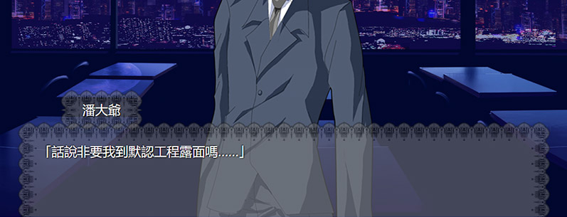
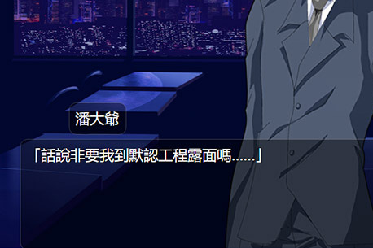
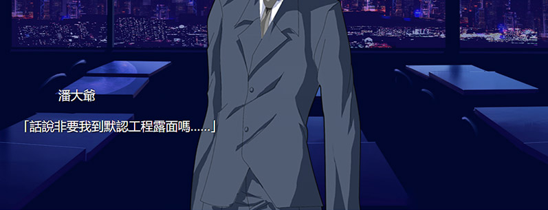
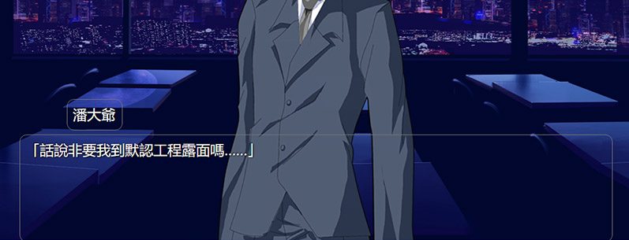

# 客製化你的遊戲

如果你想要客製化你的遊戲，最好瞭解一些關聯的知識，如html和css。畢竟，武裝自己的應該是知識，而不是一堆廢銅爛鐵。當然不學也沒關係吧……

## 修改配置

在工程的「工程配置.yaml」中，你可以指定一些和項目相關的參數。

### 基本設定
__標題__   
爲你的遊戲起一個響亮的名字。   
這個名字會顯示在標題欄。

__主題css__   
選擇一個你喜歡的adv界面外觀。   
    
    
預先配置的主題會在下面列出。  


### 路徑設定
__圖標__   
指定「圖標」來改變標題欄圖標。
```
標題: 夢想下鄉
圖標: 畫面/萃香.ico
```


   
<small>(這個nvidia是什麼東西……)</small>

__標題畫面__   
指定「標題畫面」來使用一個title界面。你也許想要自己的title界面，如果你有一定的html基礎，這並不是什麼難事。
```
標題畫面: 標題畫面/title.html
```
   
title.html的寫法在[進階/畫面的定製](../進階/畫面的定製.md)中介紹。

__劇本入口__   
指定「劇本入口」來選擇開始遊戲時的劇本。


__自定css__   
指定「自定css」後，你可以在你的css中改變adv畫面的外觀，比如更換遊戲的字體大小，添加漂亮的光標或者對話框等。   
如果想要給遊戲，你可以使用自定css。自定css是adv頁面會額外引用的css，在其中覆蓋原有的css設定就可以完全改變畫面的樣貌。   
詳細在[進階/畫面的定製](../進階/畫面的定製.md)中介紹。

### 位置設定

__主解析度__   
就是你的遊戲窗口的大小。你準備的CG啊，BG啊，最好都符合這個大小，否則切換圖片的時候會有奇怪的縮放表現<small>(由於webkit的crossfade的奇怪特性)</small>。   
對了，因爲現在16:9很流行，所以在很多用戶的顯示器下，主解析度不是16:9的遊戲全屏時會有邊框。   
還有就是，更改主解析度以後如果畫面元素的位置不對的話，可以自定css來解決。

__默認立繪位置__   
不同人数时，各人从左到右的位置。   
在鏡頭的簡化寫法中，如 <code>+ [潘大爺, 林梓雨]</code> ，就會使用他們的默認立繪位置。
```
默認立繪位置: 
    1:
      - [300,0]
    2:
      - [100,0]
      - [550,0]
```
當畫面中有一個人—— <code>潘大爺</code> 時， <code>潘大爺</code> 就會被安排在 <code>[300,0]</code> 的位置。   
當畫面中有兩個人——第一個是 <code>潘大爺</code> ，第二個是 <code>林梓雨</code> 時， <code>潘大爺</code> 就會被放在 <code>[100,0]</code> 的位置，而 <code>林梓雨</code> 就會被放在 <code>[550,0]</code> 的位置。

### 演出功能設定
__自動淡入動作__   
當設定爲True時，出現了一個新立繪的場合(即不在上個鏡頭中出現)，自動應用動作「淡入」。

__自動位移動作__   
當設定爲True時，一個立繪的位置改變的場合，自動應用對應的位移動作。

__自動發言表情__   
當設定爲True時，一個人講話——且她的當前表情有對應的說話表情的場合，將她的表情變成對應的說話表情。


## 嵌入其他功能
比如說這個adv劇情到一半，要進入一個魔法打架的遊戲<small>(當然這是你自己寫好的)</small>。   
這樣的情況下，我覺得好像應該把在<code>>py</code>/<code>>endpy</code>裏調用你的遊戲。如果你的遊戲能嵌入pyqt5，在主窗口添加一個層，然後嵌入你的遊戲，在結束時把層消除就好了。   
我也沒試過……

不過現在的遊戲引擎很多都能生成html5遊戲，說不定還不錯？

## 預先配置的主題
無   


黑色花紋邊框   


實框   


線框   
