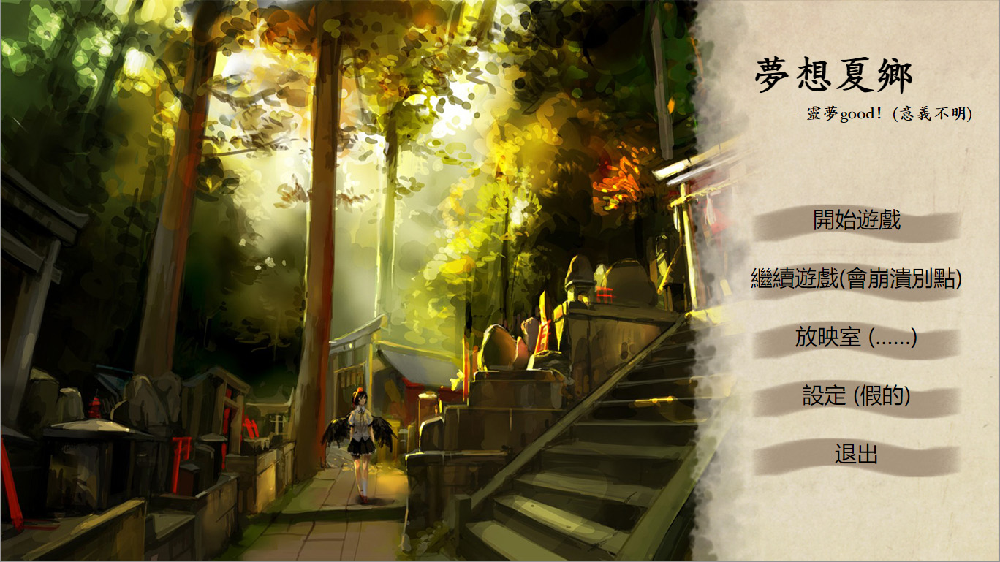

# 客製化你的遊戲

如果你想要客製化你的遊戲，最好瞭解一些關聯的知識，如html和css。畢竟，武裝自己的應該是知識，而不是一堆廢銅爛鐵。當然不學也沒關係吧……

## 修改配置

在工程的「配置.yaml」中，你可以指定一些和項目相關的參數。


__標題__   
指定「標題」來改變標題欄文字。

__圖標__   
指定「圖標」來改變標題欄圖標。
```
標題: 夢想下鄉
圖標: 畫面/萃香.ico
```


__標題畫面__   
指定「標題畫面」來使用一個title界面。你也許想要自己的title界面，如果你有一定的html基礎，這並不是什麼難事。
```
標題畫面: 標題畫面/title.html
```

至於title.html的寫法之後再介紹吧。

__劇本入口__   
指定「劇本入口」來選擇開始遊戲時的劇本。

__對話模式__   
指定「對話模式」來說明哪些形式可以被識別爲對話。在正則表達式的檢出dict中，'名'代表人物名，'顏'代表表情，'代'表示對話框中顯示的名字，'語'代表說的話。
```
對話模式: 
  通常: ^(?P<名>.+?)(\|(?P<代>.+?))? (\((?P<顏>.+?)\))?(?P<語>「.*?」)$
  隱式: ^(?P<名>.+?)(\|(?P<代>.+?))? (\((?P<顏>.+?)\))$
```
這樣匹配的就是「劇本寫法」中推薦的默認情況了。   
該死的正則表達式這還是不要改吧我自己都看不懂了……

__自定css__   
指定「自定css」後，你可以在你的css中改變adv畫面的外觀，比如更換遊戲的字體大小，光標樣式，對話框圖片等。   
詳細在接下來介紹。

__默認立繪位置__
不同人数时，各人从左到右的位置。
在鏡頭的簡化寫法中，如 __+ [潘大爺, 林梓雨]__ ，就會使用他們的默認立繪位置。
```
默認立繪位置: 
    1:
      - [300,0]
    2:
      - [100,0]
      - [550,0]
```
當畫面中只有潘大爺時，潘大爺就會被安排在[300,0]的位置。
當畫面中有兩個人，第一個是潘大爺，第二個是林梓雨時，潘大爺就會被放在[100,0]的位置，而林梓雨就會被放在[550,0]的位置。

## 自定css
如果你想要給遊戲添加漂亮的指針，或者漂亮的對話框，你就應當自定css。自定css是adv頁面會額外引用的css，在其中覆蓋原有的css設定就可以完全改變畫面的樣貌。當然別忘了把你自己的素材放在與css同一路徑。

## 主解析度
就是你的遊戲窗口的大小。你準備的CG啊，BG啊，最好都符合這個大小，否則webkit的crossfade會有奇怪的表現。還有要記住主解析度不是16:9的場合在很多用戶的顯示器下全屏時會有黑邊。

## 標題畫面的寫法
標題畫面是一個可以天馬行空地創作的html。不過要實現標題畫面的功能，還需要一點花樣。   
在head裏你得引用「/html/黑科技/qwebchannel.js」和「/html/title_js.js」來獲取標題畫面用到的幾個函數。然後在「開始遊戲」「繼續遊戲」等按鈕的點擊事件中調用對應的函數。   
如果你不太清楚這些函數的功能的話，也可以參考默認html的寫法。


## 嵌入其他功能
比如說這個adv劇情到一半，要進入一個魔法打架的遊戲(當然這是你自己寫好的)。   
這樣的情況下，我覺得好像應該把在>py/>endpy裏調用你的遊戲。如果你的遊戲能嵌入pyqt5，在主窗口添加一個層，然後嵌入你的遊戲，在結束時把層消除就好了。   
我也沒試過……

不過現在的遊戲引擎很多都能生成html5遊戲，說不定還不錯？