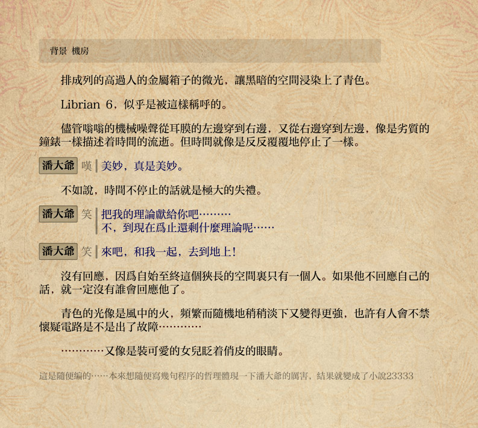

# 生成遊戲

接下來我們假設，在經過三天三夜的通宵開發之後，你做出了充滿<del>歐派</del>萝莉的galgame，並要把它交付給甲方<small>(太真實了吧)</small>！

## 生成可執行的exe文件

運行「Librian面板」，選擇你的工程進入。

點「生成exe」，就可以在Librian的路徑下生成一個exe文件。

點開這個exe就不使用Librian面板直接運行你的遊戲。

exe的圖標就是這個工程配置裏指定的圖標，如果沒有指定，會使用Librian的默認圖標。

## 把遊戲發給別人玩

因爲點開生成的exe就能玩了，所以接下來只要——

1. 把Librian的文件夾複製一遍！

2. 把「Librian面板」刪掉！

3. 把新文件夾打包，發過去！

<small>因爲實際上並沒有做任何打包啊編譯之類的工作，只是把調用python文件的命令寫在exe裏了——因此大部分的文件都必須完全保持原樣才能工作。</small>

## 脫離Librian的發佈方法

也有出於方便預覽等考慮無法使用python的時候，你可以用以下方法來發佈。

這些方法會在編譯時執行嵌入的python代碼，甚至忽略python代碼——意味着你的遊戲應當是單線的。

<small>之前還有一個導出輕文的方法，後來輕文倒閉了……</small>

### 生成純粹的網頁版

運行「Librian面板」，在「開啓工程」中選擇你的工程，點「生成html」，會生成一個js文件。

這個操作會把工程在運行過程中達到的所有狀態寫進一個js文件裏。這樣一來，「adv.html」就可以脫離python運行了。
   
將html文件夾和project文件夾放進簡單的網頁服務器裏<small>(當然要保持相對路徑不變)</small>，就可以在瀏覽器中運行了。

這個發佈是完全靜態的，因此遊玩起來完全沒有延遲，而且可以利用github page來玩耍。

不過不保證chrome以外的瀏覽器能正確運行……

### 導出pdf

「導出pdf」顧名思義地用於將你的單個劇本文件導出pdf。  
導出pdf與工程無關，只對單獨的劇本文件生效，也可以配置自己的css樣式表。

將劇本文件「編譯」之後，生成一個pdf文件，去除控制語句同時添加語義和着色。  
當你想要將你的劇本與他人分享時，導出pdf可以提供極好的可讀性。

默認樣式下導出的pdf看起來是這樣:   

<small>(pdf已經不算是遊戲了吧……)</small>   
