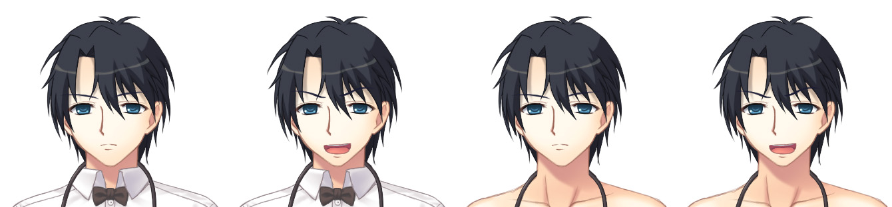
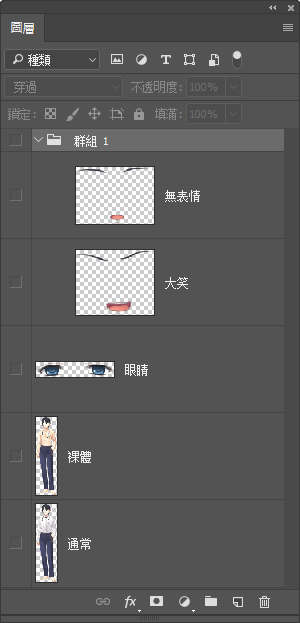

# 立繪

Librian使用自動化的立繪控制系統，你不需要對每句話指定立繪的位置。

只需要花一點時間來準備你的立繪，就能體驗到高度自動化的立繪演出。


## 準備立繪

爲了在遊戲中顯示你的角色……還是以 `潘大爺` 舉例好了 ，你可以簡單地在工程的立繪路徑下放置圖片「潘大爺.png」，這個文件就是 `潘大爺` 的人物立繪了。  
但如果這樣做， `潘大爺` 只能使用固定的表情和衣着。

如果需要用到可變的表情和衣着的話，放的就不是png而是photoshop文件「潘大爺.psd」，然後在「映射.yaml」裏指定你的差分配置。

你可以任意準備一個包含立繪各個部分的PSD，只要有頭有身體就行了。  
比如說像這樣——  
{:.極}   

上面兩個圖層是潘大爺不同表情的眉毛和嘴，然後是眼睛，下面兩個圖層是身體。

我們希望能組合出潘大爺的四種狀態，即兩種衣服搭配兩種表情:  
{:.極}  

配置文檔看起來應該像這樣:  
```yaml
潘大爺:
    衣:
        _默認:
            - 通常
        裸體:
            - 裸體
    顏: 
        _默認:
            - 無表情
            - 眼睛
        大笑:
            - 大笑
            - 眼睛
```
yaml文檔以縮進來分級，解釋一下就是: 

第一層是人物名 `潘大爺`。
:   也是psd的文件名。  

第二層是物件類別 `衣` 和 `顏`。
:   用來區分「衣」-> 衣服，「顏」-> 表情。  
    <small>(我當時隨手打的鍵……)</small>

第三層是狀態名稱 `_默認` 、 `裸體` 等等。
:   「衣」中的每一個是服裝狀態，「顏」中的每一個是表情狀態。  
    `潘大爺 (大笑)「哈哈哈！」` 中的 `大笑` 就是這裏的表情狀態。

第四層是引用的圖層名。 
:   每個狀態對應到psd文件中的哪些圖層。   
    橫線之後接一個空格，然後寫下這個狀態需要psd中的哪些圖層。


此外，如果你喜歡按圖層組整理圖層，像是這樣:   
{:.極}   
也可以把圖層組用斜線寫出，來使用包含在圖層組裏的圖層——比如 `群組 1/大笑` 即爲 `群組 1` 圖層組中的  `大笑` 圖層。


## 適用立繪

又隨便寫了樣例: 

```
@潘大爺 + 裸體    
潘大爺 「我看看……」
潘大爺 (大笑)「哈哈哈，你是豬嗎？」
```

Librian是這樣處理的——

1. `@潘大爺 + 裸體`。

    後端將 `潘大爺` 的衣服設置爲 `裸體`。

2. `潘大爺 「我看看……」` <small>(對話，沒有指定表情)</small>。
    
    後端將 `潘大爺` 的表情設置爲 `_默認` 。
    
    前端繪圖，此時 `潘大爺` 爲 `裸體+默認表情` 的狀態。因此從「潘大爺.psd」取得 `裸體` 、 `無表情` 、 `眼睛` 三個圖層，從下往上進行疊加。

3. `潘大爺 (大笑)「哈哈哈，你是豬嗎！」` <small>(對話，有表情)</small>。

    後端將 `潘大爺` 的表情設置爲 `_大笑` 。  

    前端繪圖，此時 `潘大爺` 爲 `裸體+大笑表情` 的狀態。因此從「潘大爺.psd」取得 `裸體` 、 `大笑` 、 `眼睛` 三個圖層，從下往上進行疊加。


## 額外功能

### 固有縮放
在「映射.yaml」裏你可以對每個立繪指定一個固有縮放值，將立繪整體縮放一個數值。   
這個功能可能用於:   

+ 在製作原型時，使用了東拼西湊的立繪來源。

+ 自己畫立繪的時候不小心畫大了，又不想改圖層大小的時候<small>(因爲可能會接着改圖)</small>。

```yaml
潘大爺:
    縮放:
        0.9
    衣:
        ...
    顏:
        ...
```

### 話語表情
在「映射.yaml」裏你可以對每個表情指定「默認狀態」和「話語狀態」，當前人物在說話時，當前的表情就會暫時地變成說話時的狀態。   
```yaml
    顏: 
        _默認:
            _默認:
                - 顏/通常
            _語:
                - 顏/張嘴
        笑:
            _默認:
                - 顏/笑
            _語:
                - 顏/開口笑
        怒:
            - 顏/怒
            - 特效/怒氣特效
```
對於這個例子，如果 `潘大爺` 的表情是 `笑` ，平時會使用圖層 `顏/笑` 而在輪到他說話的時候使用圖層 `顏/開口笑` 。   
如果 `潘大爺` 的表情是 `怒` ，因爲沒有指定表情狀態，輪到他說話的時候就沒有變化。


## 獲取立繪

雖然立繪功能很好，但是顯然Librian並不能解決你沒有立繪的問題……   

關於無米之炊的問題，我能想到的解決方案有: 

+ 自己畫<small>(笑)</small>。
    
    > 晉平公 「師曠啊，我今年七十歲了，想學**原畫**，怕是已經晚了。」   
    > 師曠 「天晚了就點蠟燭吧。」   
    > 晉平公 「你是臣子，怎麼能戲弄君主呢。」   
    > 師曠 「我怎敢戲弄君主。」   
    > 師曠 「年輕好學，就像陽光。年老好學，就像燭光。燭光雖然弱，但也比一片漆黑來的好。」   
    > 晉平公 「你說的有理。」   

+ 如果你有很多錢的話，可以去請畫師……

    這個時候應該推薦什麼綜合畫師服務平臺，沒有給贊助錢我纔不會說名字呢<small>(傲嬌)</small>。

+ 向原畫界宣傳開源共享的精神<small>(笑)</small>

    這樣就有數不清的原畫啦！  
    <small>(黑人問號)</small>

+ 在原型開發階段，可以借用別的GAL的拆包立繪。

    因爲後期換掉也很簡單。   
    <small>(肥宅的事情怎麼能算偷呢！)</small>
    
+ 使用先進人工智能生成圖像。
        
    - 使用 MakeGrilsMoe 生成頭像。

        [make.girls.moe](https://make.girls.moe) 是使用 GAN(生成對抗網絡) 生成頭像的網站，幾乎每個生成的頭像都是獨一無二的。  

        使用許可上，非商業用途可以免費使用。
        也就是說如果你要拿生成的頭像去steam上架的話可能就要交錢啦。  

    - 使用 StyleGAN 生成頭像。
    
        StyleGAN 是新型的生成對抗網絡，可以生成高質量的圖片。   
        <https://github.com/NVlabs/stylegan>。
    
    壞處: 爆發智械危機的時候會被機器人抓起來關進牛棚裏。
    