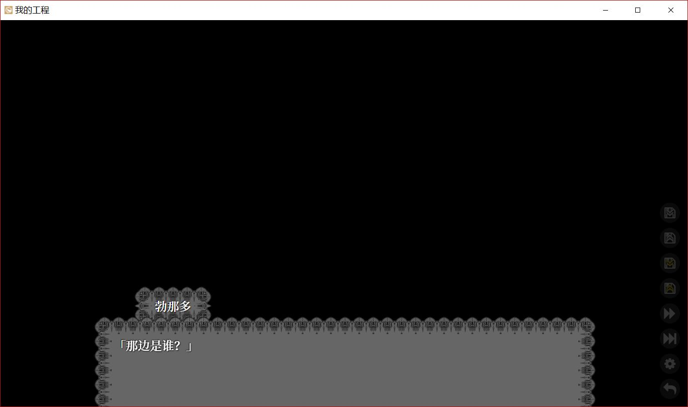
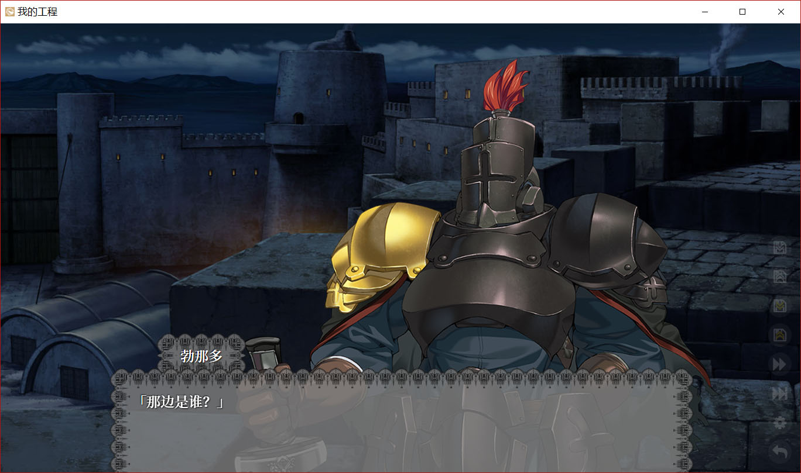
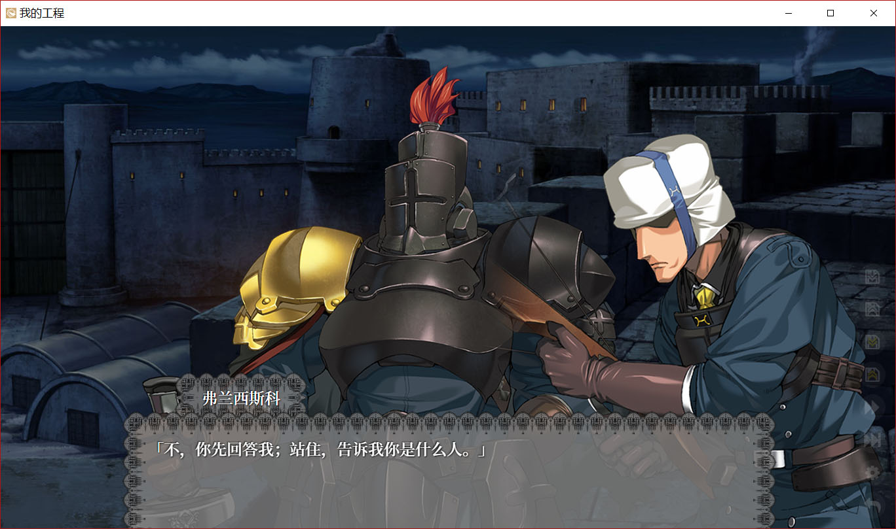

看來你已經學會了修改劇本的基本操作，接下來我們嘗試在10分鐘之內製作一個叫《哈姆雷特》的Galgame。  
<small>(這居然是Galgame？？？)</small>

## 準備劇本

你可以簡單地在搜尋引擎上找到《哈姆雷特》的劇本，這裏我們用第一段測試就足夠了。

```
第一场　艾尔西诺。城堡前的露台
　 　　　弗兰西斯科立台上守望。勃那多自对面上。
勃那多 那边是谁？
弗兰西斯科 不，你先回答我；站住，告诉我你是什么人。
勃那多 国王万岁！
弗兰西斯科 勃那多吗？
勃那多 正是。
弗兰西斯科 你来得很准时。
勃那多 现在已经打过十二点钟；你去睡吧，弗兰西斯科。
弗兰西斯科 谢谢你来替我；天冷得厉害，我心里也老大不舒服。
勃那多 你守在这儿，一切都很安静吗？
```

因爲Librian的劇本和現實劇本很相似，因此只要稍加修改就可以直接使用。  
我們就把劇本改成——

```
> BG 城堡前的露台
勃那多 「那边是谁？」
弗兰西斯科 「不，你先回答我；站住，告诉我你是什么人。」
勃那多 「国王万岁！」
弗兰西斯科 「勃那多吗？」
勃那多 「正是。」
弗兰西斯科 「你来得很准时。」
勃那多 「现在已经打过十二点钟；你去睡吧，弗兰西斯科。」
弗兰西斯科 「谢谢你来替我；天冷得厉害，我心里也老大不舒服。」
勃那多 「你守在这儿，一切都很安静吗？」
```

(如果你會用正規表達式來修改就更快了)

把上面這個這段劇本複製粘貼到「入口.liber」裏，源劇本的準備工作就完成了。

## 準備圖像

但是我們還沒有準備圖片，所以現在的遊戲雖然能玩，但是畫面是這樣的——



在工程文件夾裏，進入「我的立繪」，隨便放兩張圖，起名叫「弗兰西斯科.png」和「勃那多.png」。   
再往「我的圖片」裏放一張背景，叫「城堡前的露台.jpg」或者「城堡前的露台.png」。   
<small>(雖然建議使用PSD格式的立繪，這裏先隨便湊合一下吧。)</small>

  
  
<small>(樣例是從蘭斯裏抓出來的，我去哪裏找什麼「城堡上的露臺」……)</small>

重新運行遊戲，現在的場景變成了——



## 稍作修飾

這個遊戲已經可以玩了，但是只能同時顯示一個人的立繪，一直切換讓人好煩。

爲了讓 `弗兰西斯科` 和 `勃那多` 同臺演出，我們來指定一個雙人鏡頭 `+ [勃那多, 弗兰西斯科]`。

把剛纔的劇本改成——

```
> BG 城堡前的露台
勃那多 「那边是谁？」
+ [勃那多, 弗兰西斯科]
弗兰西斯科 「不，你先回答我；站住，告诉我你是什么人。」
勃那多 「国王万岁！」
……
```

這樣一來，畫面變成了——



## 結束

對《哈姆雷特》不太滿意？嘛，畢竟只是10分鐘做出來的啦。雖然我覺得除去找素材的時間，可能還不到10分鐘……

你可以在接下來的章節中學習更全面的知識，來把你的galgame做得活龍活現。
