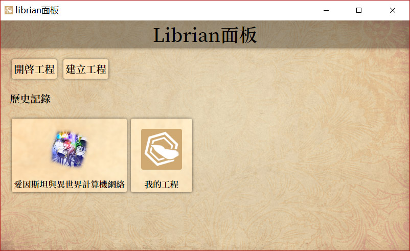
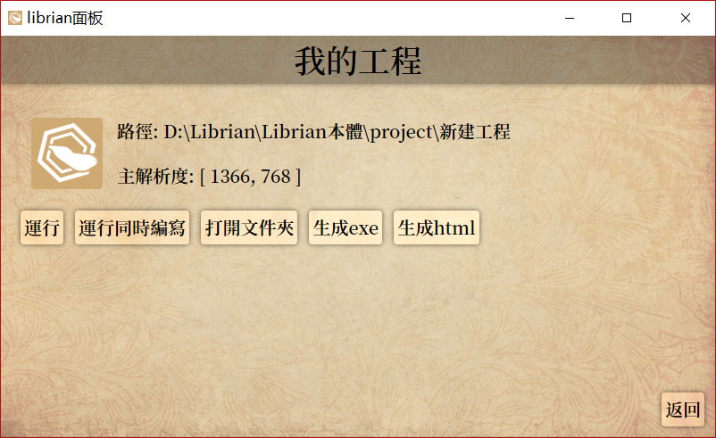

Librian是開箱即用的軟件，不需要繁瑣的安裝步驟，不需要註冊賬戶，不需要上網——當然也沒有捆綁全家桶<small>(笑)</small>。

如果你是經驗老道的開發人員，不如當做我只是一個像你的母親那樣嘮叨的傢伙……

## 下載文件

首先要下載Librian引擎，可以方便地在 [官網](https://librian.net/) 或者 [github release](https://github.com/RimoChan/Librian/releases) 下載最新的Librian安裝包。  

<small>內嵌python36大約110M。python36並不支持xp。</small>

## 安裝並運行

  
選擇路徑並<ruby>解壓縮<rt>Extract</rt></ruby>。   

至此，Librian的安裝就完成了。  

之後，雙擊帶有六邊形logo的「Librian面板.exe」，就能看到一個命令行界面以及隨後出現的窗口。  

  

## 測試

接下來，馬上建立一個新工程來實現你的美妙的想法吧。  

使用librian面板的「建立工程」，輸入你期望的遊戲名稱，就會進入工程頁面。
 

如果你試着點擊「打開文件夾」，大概就會看到這樣的文件夾內容，帶有一點用於快速上手的資源。  
{:.極}

接下來在面板中點擊「運行」，或者直接在工程文件夾裏打開「測試運行.cmd」，就可以看到帶有巨大Librian標識的默認標題畫面。  

像玩家一樣進入遊戲的話，可以看到一個叫 `潘大爺` 的奇怪男人。  

{:.極}

## 順便說一下

如果你實際看到的圖和這個說明有相異之處，說明我<small>詐稱</small>更新得很勤快以至於忘了及時更新文檔。  

偶尔会报缺少「api-ms-win-crt-runtime-l1-1-0.dll」的错误，这说明你没装VC库，得去 <https://support.microsoft.com/zh-tw/help/2977003/the-latest-supported-visual-c-downloads> 下载vc_redist。

<small>
還有安裝的上面被擋住就會變成女裝欸！
</small>
