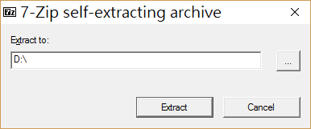
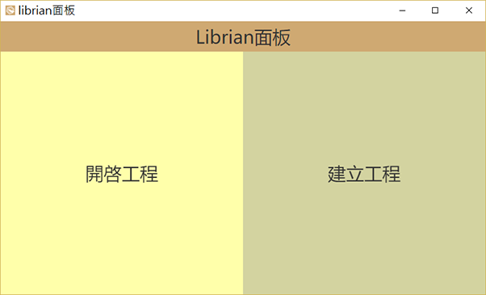
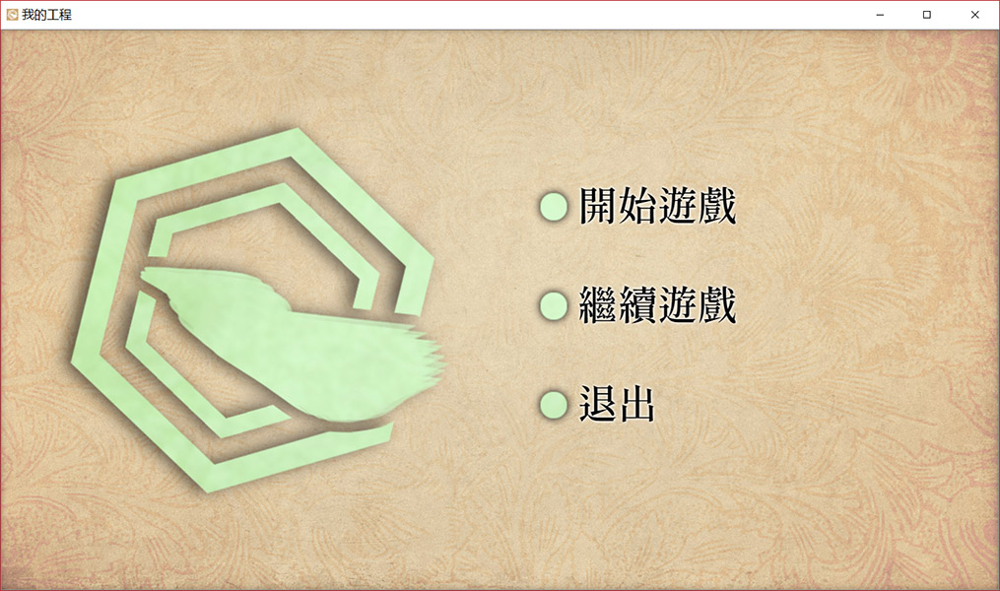
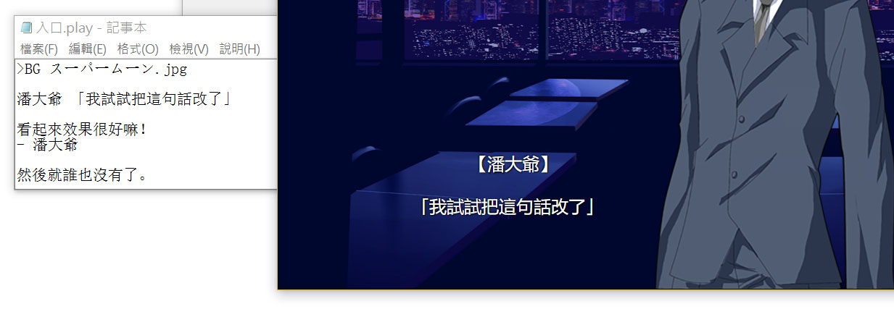

## 安裝Librian

Librian是開箱即用的軟件，不需要繁瑣的安裝步驟，不需要任何註冊——當然也沒有捆綁某全家桶<small>(笑)</small>。

如果你是經驗老道的開發人員可以當做我只是一個像你的母親那樣嘮叨的傢伙……

### 下載文件

首先要去下載Librian軟件，可以方便地在[github release](https://github.com/RimoChan/Librian/releases)下載最新的Librian自解壓檔。   
內嵌python36大約125M<small>。

<small>python36並不支持xp。</small>

### 運行

  
先把Librian解壓縮到你的電腦裏。  
似乎是psd_tool庫的原因，路徑不能包含中文。

之後，雙擊帶有六邊形logo的「Librian面板.exe」，就能看到一個命令行界面以及隨後出現的窗口。   

### 建立工程

接下來，馬上建立一個新工程來實現你的美妙的idea吧。   

使用librian面板的「建立工程」，輸入你期望的遊戲名稱，就會進入工程頁面。
 

如果你試着點擊「打開文件夾」，大概就會看到這樣的文件夾內容，帶有一點用於快速上手的資源。   

接下來在面板中點擊「運行」，或者直接在工程文件夾裏打開「測試運行.cmd」，就可以看到帶有巨大Librian標識的默認標題畫面。   

像玩家一樣進入遊戲的話，可以看到一個叫潘大爺的奇怪的男人……   

回到剛纔打開的工程文件夾，進入「我的劇本」，修改「入口.play」——它只是一個普通的字文件所以用記事本打開就行，如果你有 sublime | atom 之類更稱手的道具的話就更好了。   

修改「入口.play」之後重新啓動這個工程，就可以看到剛纔的變化了。

### 順便說一下

如果你實際看到的圖和這個說明有相異之處，說明我<small>詐稱</small>更新得很勤快以至於沒有及時更新這個文檔。   
不過厲害的傢伙，大部分問題應該是能自己搞定的吧。

<small>
還有安裝的上面被擋住就會變成女裝欸！
</small>