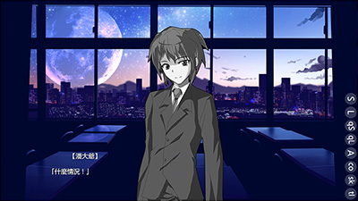

# 特效

這一節需要用到css。

## 使用特效

Librian使用css來實現特效和動作。

    潘大爺 [灰]「什麼情況！」
   

這裏的 `灰` 就是特效。   
在爲人物添加特效時，添加一個用方括號 `[]` 圈住的特效名就可以了。

## 內置的特效

**灰**   
使目標變成灰色(去除飽和度)。   
**透明**   
使目標變得透明(施加一半的透明度)。   
**淡入**   
在出現時使用動畫，短暫的漸變。   
**下入**   
在出現時使用動畫，短暫的從下方的漸變。   

## 定義特效

首先，在上個章節 [進階/畫面的定製](畫面的定製.md) 中指定「自定css」後，向css中添加類。   
<small>( `透明` 本應是內置的特效，這裏先假裝還沒有內置，算你自己寫出來的吧)</small>
```
    .透明{
        opacity:0.5;
    }
```
然後在人物處調用: 
```
    潘大爺 [透明]「相位轉移！」
```


動作也是一樣的，只要先定義幀然後用animation屬性就行了。
```
    @keyframes _淡入{
        0%{opacity:0;}
        100%{opacity:1;}
    }
    .淡入{
        animation:_淡入 0.6s;
        animation-fill-mode:forwards;
    }
```

## 畫面元素的特效
```
    > EF bg 灰
```
爲html元素「bg」設置特效「灰」，在應用之後所有的背景都會變成灰色的。
```
    > EF adv畫面 灰
```
爲整個畫面設置特效「灰」，適用於過去的記憶等場景。    


如果不指定特效就會把原有的特效清除。   
元素的特效和立繪的特效是可以通用的。   
此外，也可以往元素上套用動作特效<small>(如果確實有必要的話)</small>。

關於adv畫面中元素的層級，參考[畫面的定製](畫面的定製.md)。

## 注意
由於pyqt的webkit引擎更新得很慢，並不能支持所有css的特性，比如說在animation作用的時候，filter會失效。   
<small>(大概等他們更新就能解決吧……)</small>