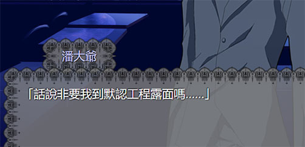

# 畫面的定製

這一節需要用到HTML和css。

## 使用css

如果想要改變adv畫面的表現，你可以指定額外的css文件。

之前雖然說過在「工程配置.yaml」裏可以設置「自定css」，但是沒有說該怎麼寫。   

在默認的adv畫面<small>(即 {librian路徑}/html/adv.html)</small>中，有這些元素:
```
    總畫面:
        配置面板:
        工具欄:
        adv畫面:
            覆蓋:
            選項:
            cg:
            bg:
            立繪:
            對話歷史:
            對話框:
                名字框:
                    名字:
                    名字框背景:
                話語框:
                    話語:
                    話語框背景:
                對話框背景:
        提示:
```

把你的樣式寫進自定css裏以後，在工程啓動時，Librian會一併加載你的css。這樣一來樣式就應用了。   

## 利用動態類

在演出過程中，對話框會被動態地附上帶有人名的類，即 `class="人物--{人物名}"` 。

可以利用這個類給不同的人設置效果。

```
.人物--潘大爺 #名字框{ 
    color: #ccf;
}
```

這樣一來，只有 `潘大爺` 的名字變成淺藍色。



## 標題畫面

標題畫面是一個可以天馬行空地創作的html，不過要實現標題畫面的功能，還需要一點花樣。    
在 `head` 裏你得引用「/html/黑科技/qwebchannel.js」和「/html/title_js.js」來獲取標題畫面用到的幾個函數。   

像是這樣:
```html
    <button click='開始()'>Click Me!</button>
```
title_js.js提供的函數包括: 
    
+ 開始     
  `開始()`   
  調用之後Librian開始讀取劇本，當前頁面由標題頁面轉到adv頁面。
+ 從title讀檔    
  `從title讀檔()`    
  讀檔，並在讀檔完成後轉到adv頁面。
+ 從劇本開始   
  `從劇本開始(劇本路徑)`   
  指定一個劇本的路徑，從這個劇本開始adv演出。

<small>(等等，函数名是什么？嗯，这些函数就是中文命名的……)</small>